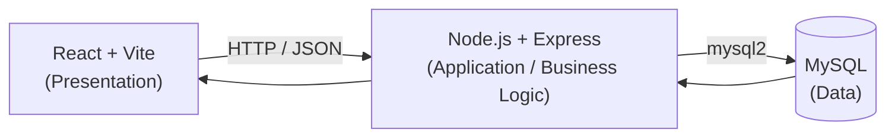

# ☕ Coffee Shop Management System

Hệ thống quản lý quán cà phê full-stack, kết nối dữ liệu **bán hàng — công thức pha chế — tồn kho nguyên liệu — báo cáo kinh doanh** thành một luồng nghiệp vụ thống nhất.

**Stack:** Node.js · Express · React · Vite · MySQL &nbsp;|&nbsp; **Trạng thái:** Đang phát triển

---

## Mục lục

- [Giới thiệu](#giới-thiệu)
- [Tính năng chính](#tính-năng-chính)
- [Kiến trúc hệ thống](#kiến-trúc-hệ-thống)
- [Công nghệ sử dụng](#công-nghệ-sử-dụng)
- [Cấu trúc thư mục](#cấu-trúc-thư-mục)
- [Bắt đầu nhanh](#bắt-đầu-nhanh)
- [Tài liệu chi tiết](#tài-liệu-chi-tiết)
- [API tổng quan](#api-tổng-quan)
- [Định hướng phát triển](#định-hướng-phát-triển)

---

## Giới thiệu

Dự án mô phỏng hoạt động vận hành thực tế của một quán cà phê, nơi **dữ liệu không tồn tại độc lập**: mỗi đơn hàng phát sinh sẽ tự động ảnh hưởng đến giá vốn, tồn kho nguyên liệu và các chỉ số kinh doanh trên dashboard.

Khi khách hàng mua một sản phẩm, hệ thống tự động thực hiện toàn bộ chuỗi xử lý:

```
Tạo đơn hàng → Lấy công thức → Tính giá vốn → Kiểm tra tồn kho
→ Trừ nguyên liệu → Ghi nhận giao dịch kho → Tính lợi nhuận gộp → Cập nhật báo cáo
```

Mục tiêu không chỉ là xây dựng một ứng dụng CRUD, mà là một **hệ thống thông tin kinh doanh (business information system) thu nhỏ**, nơi nghiệp vụ, cơ sở dữ liệu, backend, frontend và phân tích dữ liệu được kết nối chặt chẽ.

## Tính năng chính

| Nhóm chức năng             | Mô tả                                                                     |
| -------------------------- | ------------------------------------------------------------------------- |
| 🛍️ **Quản lý sản phẩm**    | CRUD sản phẩm, gắn công thức pha chế cho từng sản phẩm                    |
| 🧾 **Quản lý công thức**   | Định nghĩa nguyên liệu và định lượng cho mỗi sản phẩm                     |
| 📦 **Quản lý tồn kho**     | Theo dõi số lượng, đơn vị, giá vốn/đơn vị, mức tồn tối thiểu              |
| 💰 **Bán hàng**            | Tạo đơn, tự động tính giá vốn, kiểm tra & trừ tồn kho theo thời gian thực |
| 📋 **Quản lý đơn hàng**    | Xem lịch sử đơn, chi tiết từng đơn, doanh thu và lợi nhuận                |
| 📊 **Dashboard phân tích** | Doanh thu, gross profit/margin, sản phẩm bán chạy, cảnh báo tồn kho thấp  |

## Kiến trúc hệ thống

Hệ thống theo mô hình 3 tầng **Presentation → Application → Data**:



Chi tiết đầy đủ về luồng xử lý, database transaction và sequence diagram được mô tả trong [`ARCHITECTURE.md`](./ARCHITECTURE.md).

## Công nghệ sử dụng

**Frontend:** React · Vite · JavaScript · CSS · Recharts
**Backend:** Node.js · Express.js · mysql2 · REST API
**Database:** MySQL
**Công cụ:** VS Code · Postman · Git & GitHub

## Cấu trúc thư mục

```
coffee-shop/
├── backend/
│   ├── server.js
│   ├── package.json
│   └── ...
├── frontend/
│   ├── src/
│   │   ├── App.jsx
│   │   ├── App.css
│   │   └── pages/
│   │       ├── Dashboard.jsx
│   │       ├── Sales.jsx
│   │       ├── Products.jsx
│   │       ├── Inventory.jsx
│   │       ├── Recipe.jsx
│   │       └── Orders.jsx
│   └── package.json
└── README.md
```

## Bắt đầu nhanh

```bash
# 1. Clone dự án
git clone <repository-url>
cd coffee-shop

# 2. Cài đặt backend
cd backend
npm install
# tạo file .env với thông tin kết nối MySQL (DB_HOST, DB_USER, DB_PASSWORD, DB_NAME)
npm run dev

# 3. Cài đặt frontend (terminal khác)
cd frontend
npm install
npm run dev
```

> Import schema MySQL (bảng `products`, `ingredients`, `recipes`, `recipe_items`, `orders`, `order_items`, `stock_transactions`) trước khi chạy backend — xem chi tiết trong [`DATABASE.md`](./DATABASE.md).

## Tài liệu chi tiết

| Tài liệu                                 | Nội dung                                                                            |
| ---------------------------------------- | ----------------------------------------------------------------------------------- |
| [`BUSINESS-FLOW.md`](./BUSINESS-FLOW.md) | Nghiệp vụ chi tiết: quản lý sản phẩm, công thức, nhập kho, bán hàng, business rules |
| [`ARCHITECTURE.md`](./ARCHITECTURE.md)   | Kiến trúc kỹ thuật, sequence diagram, database transaction, API                     |
| [`DATABASE.md`](./DATABASE.md)           | ERD, giải thích quan hệ giữa các bảng, thiết kế snapshot dữ liệu                    |

## API tổng quan

| Method | Endpoint                      | Mô tả                   |
| ------ | ----------------------------- | ----------------------- |
| `GET`  | `/api/products`               | Danh sách sản phẩm      |
| `GET`  | `/api/ingredients`            | Danh sách nguyên liệu   |
| `POST` | `/api/ingredients/purchase`   | Nhập kho nguyên liệu    |
| `GET`  | `/api/recipes`                | Danh sách công thức     |
| `POST` | `/api/orders`                 | Tạo đơn hàng            |
| `GET`  | `/api/orders`                 | Lịch sử đơn hàng        |
| `GET`  | `/api/orders/:id`             | Chi tiết một đơn hàng   |
| `GET`  | `/api/stock-transactions`     | Lịch sử biến động kho   |
| `GET`  | `/api/reports/dashboard`      | Chỉ số tổng quan        |
| `GET`  | `/api/reports/top-products`   | Sản phẩm bán chạy       |
| `GET`  | `/api/reports/product-profit` | Lợi nhuận theo sản phẩm |
| `GET`  | `/api/reports/revenue-by-day` | Doanh thu theo ngày     |

## Định hướng phát triển

- [ ] Đăng nhập & xác thực người dùng
- [ ] Phân quyền Admin / Nhân viên
- [ ] Triển khai lên môi trường cloud
- [ ] Dự báo doanh thu & nhu cầu nguyên liệu bằng AI/ML
- [ ] Tự động tạo báo cáo định kỳ

---

_Dự án được xây dựng với mục đích học tập và thực hành phát triển hệ thống, kết hợp cơ sở dữ liệu, backend, frontend và phân tích dữ liệu kinh doanh._
