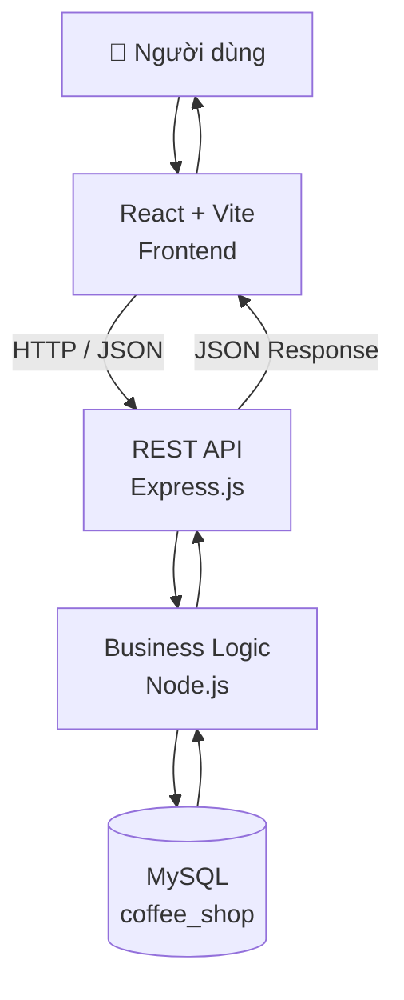
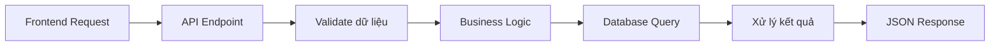
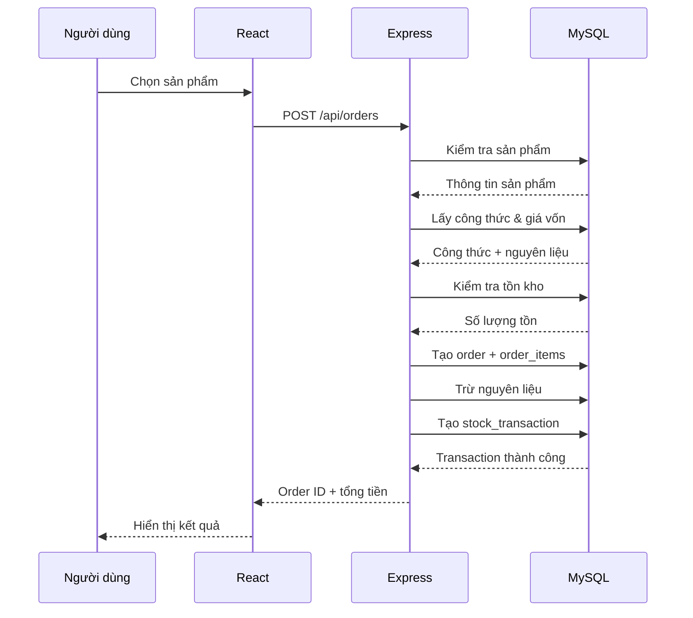
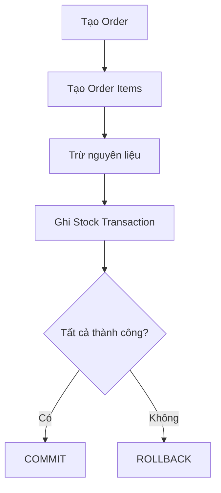
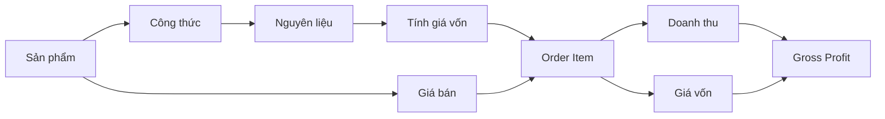
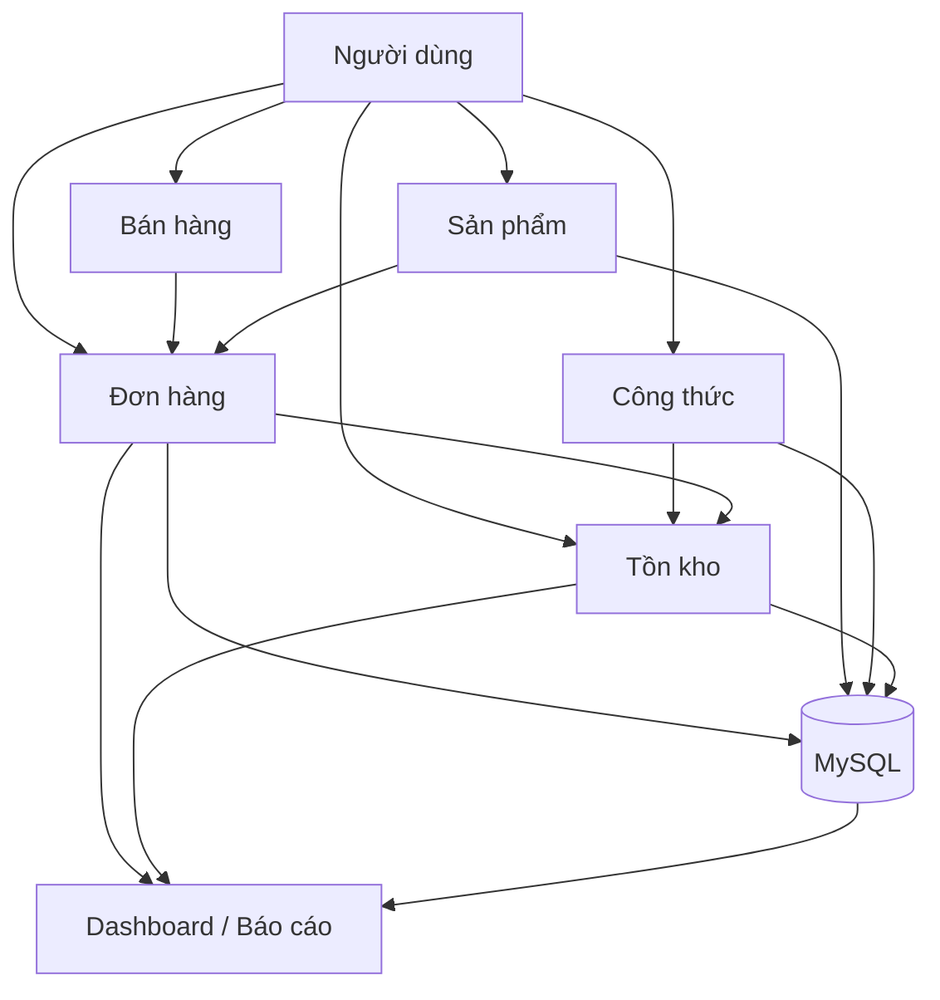

# 🏗️ Kiến trúc hệ thống — Coffee Shop Management System

> Tài liệu mô tả kiến trúc kỹ thuật của hệ thống: các tầng xử lý, luồng dữ liệu, database transaction và thiết kế API.

## Mục lục

1. [Kiến trúc tổng thể](#1-kiến-trúc-tổng-thể)
2. [Presentation Layer — Frontend](#2-presentation-layer--frontend)
3. [Application Layer — Backend](#3-application-layer--backend)
4. [Data Layer — Database](#4-data-layer--database)
5. [Luồng xử lý một đơn hàng](#5-luồng-xử-lý-một-đơn-hàng)
6. [Database Transaction](#6-database-transaction)
7. [Luồng quản lý tồn kho](#7-luồng-quản-lý-tồn-kho)
8. [Luồng tính lợi nhuận](#8-luồng-tính-lợi-nhuận)
9. [Luồng dữ liệu tổng thể](#9-luồng-dữ-liệu-tổng-thể)
10. [API Reference](#10-api-reference)
11. [Tổng kết](#11-tổng-kết)

---

## 1. Kiến trúc tổng thể

Hệ thống được thiết kế theo mô hình **3 tầng (3-tier architecture)**: Presentation — Application — Data.



Việc tách rời 3 tầng giúp hệ thống **dễ bảo trì, dễ kiểm thử và có thể mở rộng độc lập** ở từng phần (ví dụ: thay đổi giao diện mà không ảnh hưởng đến business logic).

## 2. Presentation Layer — Frontend

**Công nghệ:** React · Vite · JavaScript · CSS · Recharts

Chịu trách nhiệm:
- Hiển thị giao diện và tiếp nhận thao tác người dùng
- Gửi request đến Backend và nhận dữ liệu JSON
- Trực quan hóa dữ liệu qua biểu đồ và báo cáo

**Các màn hình chính:** Dashboard · Sales · Products · Inventory · Recipe · Orders

## 3. Application Layer — Backend

**Công nghệ:** Node.js · Express.js · mysql2

Backend là trung gian giữa Frontend và Database, không chỉ thực hiện CRUD mà còn đảm nhiệm toàn bộ **business logic** của hệ thống:



## 4. Data Layer — Database

**Công nghệ:** MySQL — database `coffee_shop`

| Bảng | Vai trò |
|---|---|
| `products` | Danh mục sản phẩm |
| `ingredients` | Danh mục nguyên liệu & tồn kho |
| `recipes` | Công thức pha chế theo sản phẩm |
| `recipe_items` | Chi tiết nguyên liệu trong từng công thức |
| `orders` | Đơn hàng |
| `order_items` | Chi tiết sản phẩm trong từng đơn hàng |
| `stock_transactions` | Lịch sử biến động kho (nhập/xuất) |

Chi tiết quan hệ giữa các bảng: xem [`DATABASE.md`](./DATABASE.md).

## 5. Luồng xử lý một đơn hàng



**Các bước xử lý phía backend khi nhận request tạo đơn:**

1. Kiểm tra dữ liệu đầu vào
2. Kiểm tra `product_id` tồn tại
3. Lấy giá bán sản phẩm
4. Lấy giá vốn từ công thức
5. Kiểm tra sản phẩm có công thức hợp lệ
6. Tính tổng tiền đơn hàng
7. Tạo bản ghi `order`
8. Tạo các bản ghi `order_items`
9. Tính tổng nguyên liệu cần sử dụng
10. Kiểm tra tồn kho đủ hay không
11. Trừ nguyên liệu khỏi tồn kho
12. Ghi nhận `stock_transactions`
13. Hoàn thành đơn hàng
14. Commit transaction

## 6. Database Transaction

Toàn bộ quá trình tạo đơn được bọc trong **một database transaction** để đảm bảo tính nhất quán dữ liệu:



Nhờ vậy hệ thống tránh được các tình trạng dữ liệu không nhất quán, ví dụ: *đã tạo đơn nhưng chưa trừ kho*, hoặc *đã trừ kho nhưng tạo đơn thất bại*.

## 7. Luồng quản lý tồn kho

**Nhập nguyên liệu:**

```
Người dùng → Nhập nguyên liệu → POST /api/ingredients/purchase
→ Cập nhật stock_quantity → Tạo PURCHASE transaction → MySQL
```

**Xuất nguyên liệu khi bán hàng:**

```
Bán 2 Latte → Lấy công thức Latte
→ Cà phê 20g×2=40g | Sữa 150ml×2=300ml | Đường 5g×2=10g | Đá 100g×2=200g
→ Kiểm tra tồn kho → Trừ nguyên liệu → Tạo SALE transaction
```

Tồn kho nguyên liệu luôn được cập nhật dựa trên **hoạt động bán hàng thực tế**, không phải thao tác thủ công.

## 8. Luồng tính lợi nhuận



```
Gross Profit = Doanh thu − Giá vốn
Gross Margin = Gross Profit / Doanh thu × 100%
```

## 9. Luồng dữ liệu tổng thể



## 10. API Reference

| Method | Endpoint | Mô tả |
|---|---|---|
| `GET` | `/api/products` | Lấy danh sách sản phẩm |
| `POST` | `/api/orders` | Tạo đơn hàng mới |
| `GET` | `/api/orders` | Lấy lịch sử đơn hàng |
| `GET` | `/api/orders/:id` | Lấy chi tiết một đơn hàng |
| `POST` | `/api/ingredients/purchase` | Nhập kho nguyên liệu |
| `GET` | `/api/reports/product-profit` | Báo cáo lợi nhuận theo sản phẩm |

## 11. Tổng kết

| Tầng | Công nghệ | Trách nhiệm |
|---|---|---|
| Presentation | React | Giao diện, tương tác người dùng |
| Application | Node.js + Express | API, business logic, transaction |
| Data | MySQL | Lưu trữ và quản lý dữ liệu |

Việc tách tầng rõ ràng giúp hệ thống dễ bảo trì và có khả năng mở rộng trong tương lai (thêm xác thực, phân quyền, triển khai cloud, tích hợp AI/ML cho dự báo).
