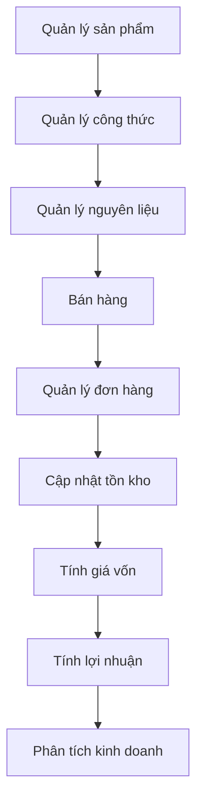
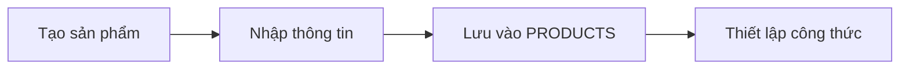
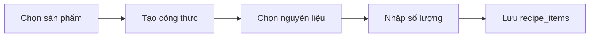
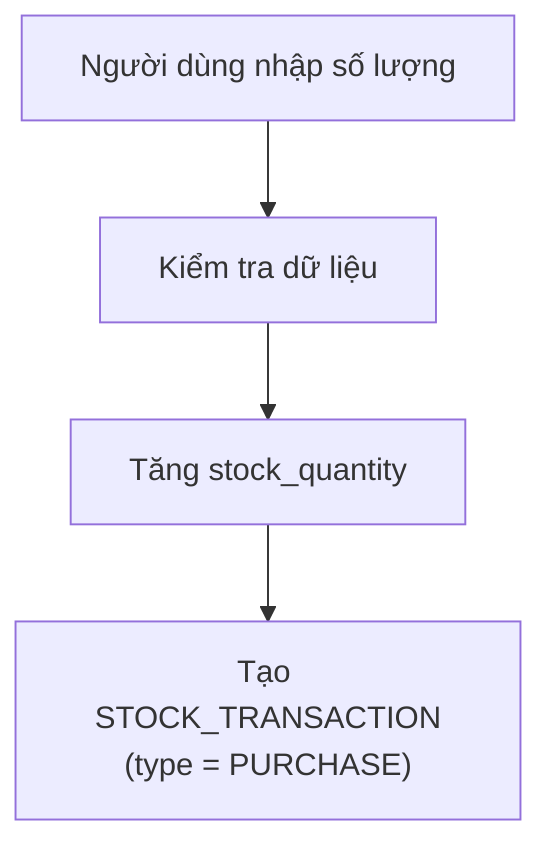
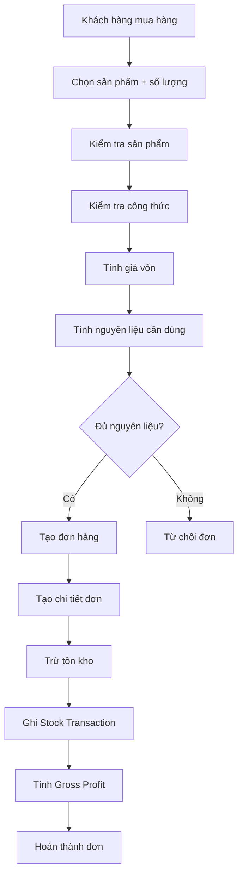
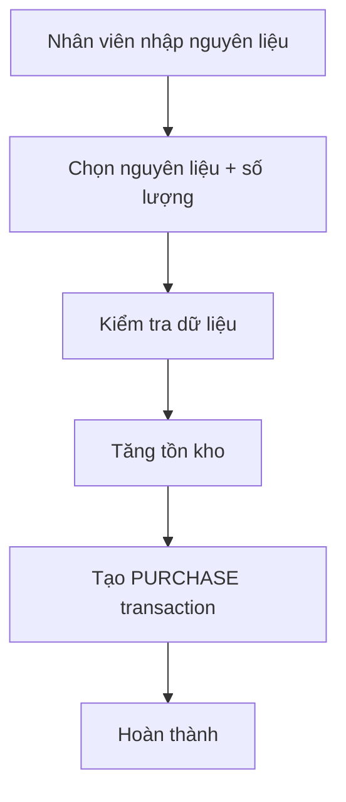

# 📋 Nghiệp vụ hệ thống — Coffee Shop Management System

> Tài liệu mô tả chi tiết các nghiệp vụ, actor, business rules và luồng xử lý của hệ thống.

## Mục lục

1. [Tổng quan nghiệp vụ](#1-tổng-quan-nghiệp-vụ)
2. [Actor](#2-actor)
3. [Quản lý sản phẩm](#3-quản-lý-sản-phẩm)
4. [Quản lý công thức](#4-quản-lý-công-thức)
5. [Nhập kho](#5-nhập-kho)
6. [Bán hàng](#6-bán-hàng)
7. [Lịch sử đơn hàng](#7-lịch-sử-đơn-hàng)
8. [Dashboard](#8-dashboard)
9. [Business Rules](#9-business-rules)
10. [Business Flow tổng thể](#10-business-flow-tổng-thể)

---

## 1. Tổng quan nghiệp vụ

Hệ thống mô phỏng hoạt động vận hành của một quán cà phê theo chuỗi nghiệp vụ:



## 2. Actor

| Actor | Vai trò |
|---|---|
| **Nhân viên** | Bán hàng, nhập kho, xem đơn hàng |
| **Quản lý** | Theo dõi sản phẩm, tồn kho, doanh thu và lợi nhuận |

> Phiên bản hiện tại **chưa triển khai đăng nhập và phân quyền** — đây là hạn chế đã được ghi nhận trong định hướng phát triển.

## 3. Quản lý sản phẩm

**Mục tiêu:** Quản lý các sản phẩm được bán tại quán.

**Dữ liệu:** Tên sản phẩm · Giá bán · Mô tả · Công thức liên kết



## 4. Quản lý công thức

**Mục tiêu:** Xác định nguyên liệu cần sử dụng để tạo ra một sản phẩm.

**Ví dụ — Công thức Latte:**

| Nguyên liệu | Định lượng |
|---|---|
| Cà phê hạt | 20g |
| Sữa tươi | 150ml |
| Đường | 5g |
| Đá | 100g |



## 5. Nhập kho

**Mục tiêu:** Tăng số lượng nguyên liệu trong kho.

**Input:** Nguyên liệu · Số lượng · Ghi chú



**Ví dụ:** Cà phê hạt tồn `5.000g` + nhập `1.000g` → tồn mới `6.000g`

## 6. Bán hàng

Đây là nghiệp vụ trung tâm của hệ thống. Người dùng chọn sản phẩm và số lượng (ví dụ: `Latte × 2`, `Americano × 1`), backend xử lý theo các bước sau:

### Bước 1 — Kiểm tra sản phẩm
Kiểm tra `product_id` gửi lên có tồn tại hay không. Nếu không → **từ chối tạo đơn**.

### Bước 2 — Tính giá vốn
Lấy công thức của sản phẩm và tính giá vốn dựa trên đơn giá từng nguyên liệu.

| Nguyên liệu | Định lượng | Đơn giá | Thành tiền |
|---|---|---|---|
| Cà phê hạt | 20g | 180đ | 3.600đ |
| Sữa tươi | 150ml | 32đ | 4.800đ |
| Đường | 5g | 25đ | 125đ |
| Đá | 100g | 2đ | 200đ |
| **Giá vốn Latte** | | | **8.725đ** |

### Bước 3 — Kiểm tra tồn kho
Tính tổng lượng nguyên liệu cần dùng (ví dụ Latte × 2 → Cà phê 40g, Sữa 300ml, Đường 10g, Đá 200g) và so sánh với tồn kho hiện tại.

- **Không đủ** → không tạo đơn, không trừ kho
- **Đủ** → cho phép tiếp tục

### Bước 4 — Tạo đơn hàng
Tạo bản ghi trong `orders` (ví dụ: `Order #10`, `total = 55.000đ`, `status = completed`).

### Bước 5 — Lưu chi tiết đơn hàng
Lưu vào `order_items`: `product_id`, `quantity`, `unit_price`, `subtotal`, `unit_cost`, `cost_subtotal`.

### Bước 6 — Trừ nguyên liệu
Giảm `stock_quantity` theo công thức (ví dụ Latte × 2 → trừ Cà phê 40g, Sữa 300ml, Đường 10g, Đá 200g).

### Bước 7 — Ghi nhận lịch sử kho
Tạo giao dịch trong `stock_transactions` với `type = SALE` và `reference = Order #10` để truy xuất nguồn gốc biến động kho.

### Bước 8 — Tính lợi nhuận
```
Lợi nhuận gộp = Doanh thu − Giá vốn
             = 30.000 − 8.725 = 21.275đ
```

## 7. Lịch sử đơn hàng

Người dùng có thể xem danh sách đơn hàng → chọn một đơn → xem chi tiết: sản phẩm, số lượng, giá bán, doanh thu, giá vốn, lợi nhuận.

## 8. Dashboard

Dashboard tổng hợp dữ liệu từ các bảng giao dịch:

- Số đơn · Doanh thu · Giá vốn
- Gross Profit · Gross Margin
- Sản phẩm bán chạy · Doanh thu theo ngày
- Tồn kho hiện tại · Nguyên liệu sắp hết

## 9. Business Rules

| Mã | Quy tắc |
|---|---|
| **BR-01** | Sản phẩm phải tồn tại — không tạo đơn nếu `product_id` không tồn tại |
| **BR-02** | Sản phẩm bán phải có công thức để hệ thống tự động tính giá vốn và trừ kho |
| **BR-03** | Không được bán khi nguyên liệu không đủ — không tạo đơn, không trừ kho |
| **BR-04** | Số lượng bán phải lớn hơn 0 (`quantity > 0`) |
| **BR-05** | Giá bán được lưu tại thời điểm giao dịch (`order_items.unit_price`) — không đổi dù giá sản phẩm thay đổi sau đó |
| **BR-06** | Giá vốn được lưu tại thời điểm giao dịch (`order_items.unit_cost`) — đảm bảo báo cáo lợi nhuận lịch sử ổn định |
| **BR-07** | Tồn kho phải được cập nhật cùng giao dịch bán hàng (Order + Order Items + Inventory Deduction + Stock Transaction xử lý nhất quán) |
| **BR-08** | Giao dịch kho phải có loại: `PURCHASE` (nhập kho) hoặc `SALE` (xuất kho do bán hàng) |

## 10. Business Flow tổng thể



**Nghiệp vụ nhập kho:**



**Nghiệp vụ báo cáo:**

```
Orders + Order Items + Products + Ingredients
        ↓
   Reporting API → Dashboard
        ↓
Trả lời: Hôm nay bán bao nhiêu? Sản phẩm nào bán chạy?
Giá vốn/lợi nhuận bao nhiêu? Nguyên liệu nào sắp hết?
```
