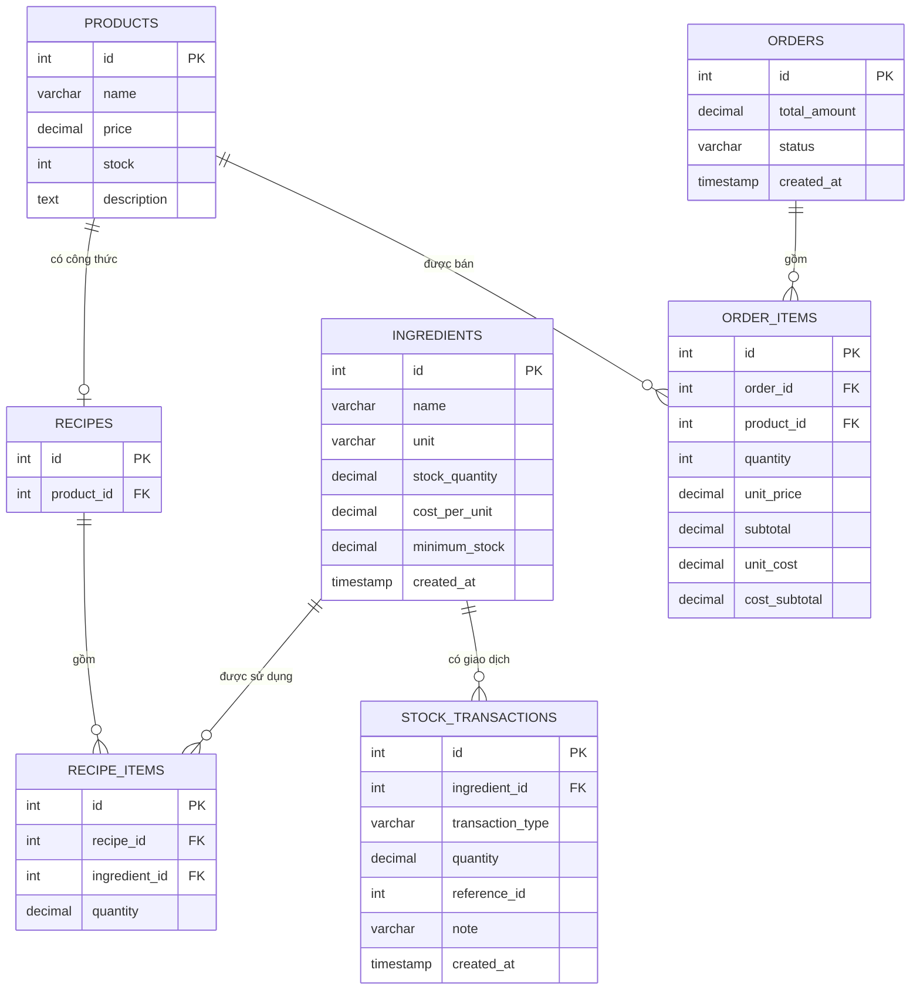

# 🗄️ Thiết kế cơ sở dữ liệu — Coffee Shop Management System

> Tài liệu mô tả sơ đồ quan hệ thực thể (ERD), ý nghĩa từng quan hệ và các quyết định thiết kế quan trọng.

## Mục lục

1. [Sơ đồ ERD](#1-sơ-đồ-erd)
2. [Products ↔ Recipes](#2-products--recipes)
3. [Recipes ↔ Recipe Items ↔ Ingredients](#3-recipes--recipe-items--ingredients)
4. [Orders ↔ Order Items ↔ Products](#4-orders--order-items--products)
5. [Ingredients ↔ Stock Transactions](#5-ingredients--stock-transactions)
6. [Thiết kế snapshot dữ liệu lịch sử](#6-thiết-kế-snapshot-dữ-liệu-lịch-sử)
7. [Luồng dữ liệu chính](#7-luồng-dữ-liệu-chính)

---

## 1. Sơ đồ ERD



## 2. Products ↔ Recipes

**Quan hệ:** 1 – 1 (tùy chọn)

Một sản phẩm có **tối đa một** công thức. Ràng buộc `recipes.product_id UNIQUE` đảm bảo một sản phẩm không thể có nhiều công thức khác nhau.

```
Coffee ── Recipe Coffee
```

## 3. Recipes ↔ Recipe Items ↔ Ingredients

**Quan hệ:** Many-to-many, giải quyết qua bảng trung gian `recipe_items`

Một công thức gồm nhiều nguyên liệu, và một nguyên liệu có thể xuất hiện trong nhiều công thức khác nhau:

| Nguyên liệu | Latte | Coffee | Americano |
|---|:---:|:---:|:---:|
| Cà phê hạt | ✅ | ✅ | ✅ |
| Sữa tươi | ✅ | ❌ | ❌ |
| Đường | ✅ | ✅ | ✅ |
| Đá | ✅ | ❌ | ✅ |

**Ví dụ công thức Latte:**

```
Cà phê hạt   20g
Sữa tươi    150ml
Đường          5g
Đá           100g
```

## 4. Orders ↔ Order Items ↔ Products

**Quan hệ:** 1 – N (Orders → Order Items), N – 1 (Order Items → Products)

- Một đơn hàng chứa nhiều sản phẩm → lưu trong `order_items`
- Một sản phẩm có thể xuất hiện trong nhiều đơn hàng khác nhau

```
Order #10
├── Latte × 1
└── Americano × 1
```

## 5. Ingredients ↔ Stock Transactions

**Quan hệ:** 1 – N

Mỗi nguyên liệu có một lịch sử biến động kho đầy đủ, cho phép truy xuất nguồn gốc mọi thay đổi tồn kho:

```
Cà phê hạt:  +1000g (PURCHASE)  −20g (SALE)  −40g (SALE)  +2000g (PURCHASE)
```

## 6. Thiết kế snapshot dữ liệu lịch sử

Đây là điểm thiết kế quan trọng nhất của hệ thống: bảng `order_items` không chỉ lưu `unit_price` / `subtotal` (giá bán) mà còn lưu **`unit_cost` / `cost_subtotal`** (giá vốn) — đây là **snapshot dữ liệu tại thời điểm bán**.

**Ví dụ:**

| Thời điểm | Giá vốn Latte | Giá bán |
|---|---|---|
| Ngày bán (lưu vào `order_items.unit_cost`) | 8.725đ | 30.000đ |
| Sau này giá sữa tăng | 10.000đ | — |
| Đơn hàng cũ vẫn giữ | **8.725đ** | 30.000đ |

→ Nhờ snapshot này, **báo cáo lợi nhuận lịch sử không bị thay đổi** khi giá nguyên liệu hoặc giá bán biến động sau đó.

## 7. Luồng dữ liệu chính

**Tính giá vốn:**

```
PRODUCTS → RECIPES → RECIPE_ITEMS → INGREDIENTS → Giá vốn
```

**Khi bán hàng:**

```
PRODUCTS → ORDERS → ORDER_ITEMS → Doanh thu + Giá vốn + Lợi nhuận
                                 → INGREDIENTS → STOCK_TRANSACTIONS
```

Đây chính là mối liên kết cốt lõi của toàn hệ thống:

**Bán hàng → Kho → Giá vốn → Lợi nhuận → Báo cáo**
